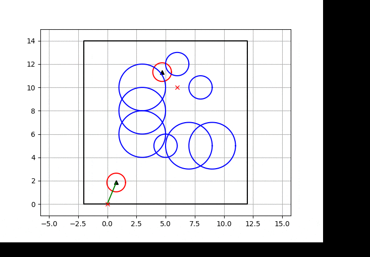
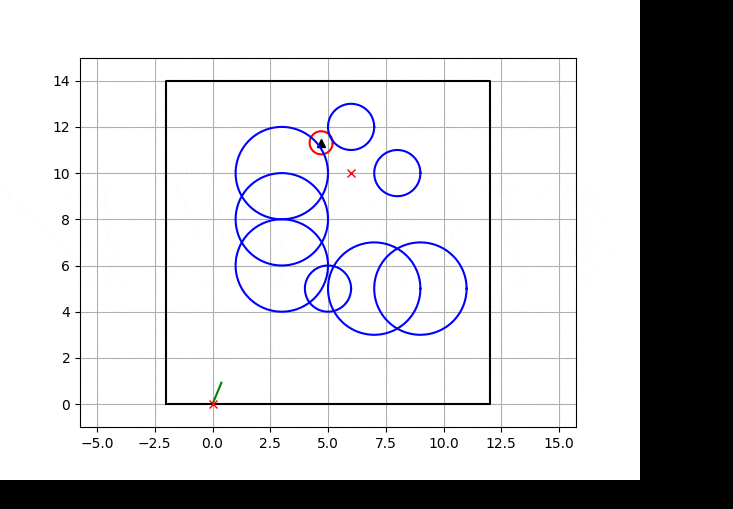

# 简介

自动驾驶常用路径规划算法C++实现


# 项目依赖

推荐在Ubuntu 18.04/20.04 环境下运行

- **cmake**

  在Ubuntu中安装cmake：

  ```
  sudo apt install cmake
  ```

- **Eigen**

  在Ubuntu中安装Eigen：

  ```
  sudo apt-get install libeigen3-dev
  ```

- **python3**


# 编译

在当前目录下输入：

```shell
mkdir build
cd build
cmake ../
make
```


# Path_planning

## Dijkstra


## A star


## RRT


## RRT connect



## RRT star




## Bezier


## B spline


# 参考

[PythonRobotics](https://github.com/AtsushiSakai/PythonRobotics#pythonrobotics)

[chhRobotics_CPP](https://github.com/CHH3213/chhRobotics_CPP)

